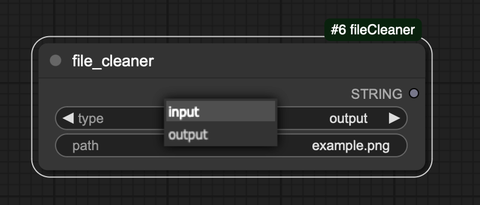

# ComfyUI-fileCleaner

In production environments, images are usually saved on storage servers such as S3, rather than local folders. So the method of placing images in local folders using ComfyUI's native LoadImage and SaveImage nodes cannot be used as a deployment service method, but can only be used as a temporary storage place for images. This requires a way to delete images from the input and output folders.

This node is used to delete images from the input and output folders. It is recommended to use this node through api call in the backend after the image processing is completed.

## how to use

You could choose the folder (input / output), and the filename you want to delete.


## installation

the installation method is the same as the other custom nodes.

1. change directory to custom nodes of ComfyUI:
```bash
cd ~/ComfyUI/custom_nodes
```
2. clone the repository:
```bash
git clone https://github.com/Poseidon-fan/ComfyUI-fileCleaner.git
```
3. restart ComfyUI
4. you could find this node under the "utils" menu
